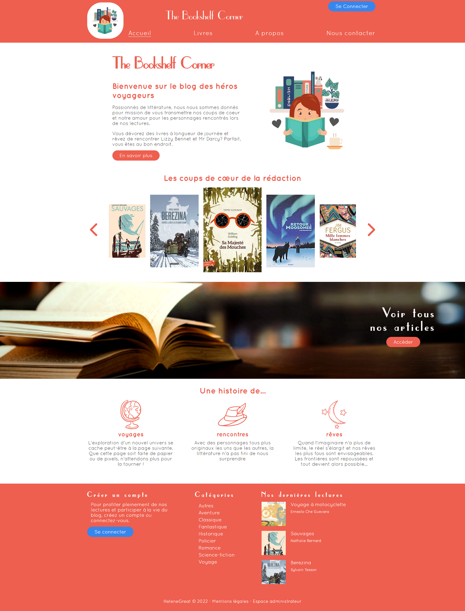
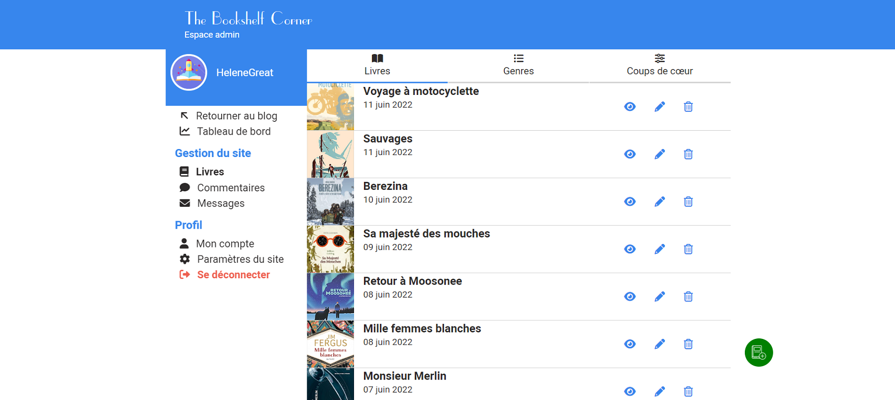

- [The Bookshelf Corner](#the-bookshelf-corner)
  - [Technologies utilisées](#technologies-utilisées)
  - [Présentation du projet](#présentation-du-projet)
    - [*Front / visiteurs*](#front--visiteurs)
    - [*Back / utilisateurs enregistrés*](#back--utilisateurs-enregistrés)
    - [*Back / administrateurs*](#back--administrateurs)
  - [Installation](#installation)
  - [Quelques pistes d'amélioration](#quelques-pistes-damélioration)

# The Bookshelf Corner

Bienvenue sur mon projet de fin d'étude, dans le cadre de la formation Kercode 2022 **BTS Développeur intégrateur en réalisation d'application web**, au GRETA de Vannes (56).

Il s'agit d'un blog littéraire fictif.

Une version du site est disponible en ligne : [helenegreat.alwaysdata.net/bookshelf_corner](https://helenegreat.alwaysdata.net/bookshelf_corner).

## Technologies utilisées
- HTML
- CSS : l'ensemble du site est responsive et construit en *mobile-first*
- Javascript
- PHP : orienté objet
- SQL : CRUD complet et jointures

L'architecture du site respecte le modèle **MVC** (*Model - View - Controller*)
- Chaque table de la base de données a son controller et son model, avec en plus :
  - un controller pour gérer les vues du front
  - un controller et un manager génériques, parents des autres controllers et models. Ils permettent de stocker les fonctions s'appliquant à plusieurs tables de la base.
-  Un dossier *form* chargé de la gestion des erreurs et succès lors de la soumission d'un formulaire
-  Deux routeurs : *index.php* pour le front et *indexAdmin.php* pour le back
-  Pour information, lorsqu'une fonction ou une action se termine par "*Post*", cela signifie qu'elle traite les informations d'un formulaire

Pour gérer les dépendances, ***Composer*** a été installé.

## Présentation du projet

### *Front / visiteurs*
- Accueil : le carousel avec les *coups de coeur de la rédaction* est modifiable par les administrateurs
- Livres : tous les articles publiés. Ils peuvent aussi être triés par catégorie / genre littéraire
- Une page indivuelle pour chaque livre, avec un espace de commentaires pour les utilisateurs enregistrés
- A propos
- Nous contacter
- Mentions légales
- Formulaires de création de compte ou de [connexion pour les utilisateurs](https://helenegreat.alwaysdata.net/bookshelf_corner/index.php?action=connexionUser)

### *Back / utilisateurs enregistrés*
- Tableau de bord : statistiques sur les commentaires publiés par l'utilisateur
- Commentaires : gestion de l'ensemble de ses commentaires *(consultation, modification, suppression)*
- Mon compte : modifier ses données *(pseudo, mail, photo de profil, mot de passe)*

### *Back / administrateurs*
- Formulaire de [connexion pour les administrateurs](https://helenegreat.alwaysdata.net/bookshelf_corner/indexAdmin.php?action=connexionAdmin)
- Tableau de bord : statistiques de l'ensemble du blog (dernier livre, compte utilisateur, commentaire, message reçu)
- Livres :
  - Livres : gestion complète des livres / articles publiés
  - Genres : gestion des catégories littéraires. Le genre ***Autres*** n'est pas modifiable car c'est le genre par défaut dans lequel basculent les livres si leur catégorie est supprimée
  - Coups de coeur : permet de choisir quels livres seront visibles dans le carousel en page d'accueil
- Commentaires : 
  * Modération de l'ensemble des commentaires publiés sur le site *(consultation, suppression)*
  * Gestion de ses propres commentaires *(consultation, modification, suppression)*
- Messages : gestion de l'ensemble des messages reçus par le formulaire de contact
- Mon compte : modifier ses données *(pseudo, mail, photo de profil, mot de passe)*
- Paramètres du site (**accès réservé aux super-admin**) :
  - Modifier les informations du blog (nom et logo) : les pages front et admin seront modifiées avec ces nouvelles informations
  - Ajouter un nouveau compte administrateur

Il existe deux types d'administrateurs, définit par leur ***rôle*** en base de données :
- admin lambda (rôle = 1)
- super admin (rôle = 2)

Pour modifier le type d'un admin, il suffit de modifier la valeur de sa colonne "role" dans la base de données. Si l'admin était connecté, il faudra se reconnecter pour réinitialiser les variables de session.

Quant à eux, les utilisateurs enregistrés ont un rôle égal à 0.

## Installation
Un diagramme UML de la base de donnée se trouve à la racine du projet (.png et .drawio), ainsi qu'un dump.sql

Pour installer le projet :
- Télécharger les fichiers du repository et dézipper le dossier
- Installer composer puis taper la commande 'composer install' dans le répertoire du site
- Vous pouvez créer un nouveau compte utilisateur ou utiliser les identifiants ci-dessous

Accéder aux différents comptes :
- [Utilisateur enregistré](https://helenegreat.alwaysdata.net/bookshelf_corner/index.php?action=connexionUser) : 
  - Mail : user@user.com
  - Mot de passe : kercode
- [Super administrateur](https://helenegreat.alwaysdata.net/bookshelf_corner/indexAdmin.php?action=connexionAdmin) : 
  - Mail : hgreat@admin.com
  - Mot de passe : kercode

## Quelques pistes d'amélioration

* En front, ajouter la possibilité de trier les articles en fonction de l'administrateur qui les ont rédigés. Sur la page "A propos", lorsqu'on clique sur la carte d'un administrateur, on arriverait sur la liste de tous ses articles
* Ajouter un champs de confirmation de mot de passe lors de la création ou modification de son compte
* Ajouter la possibilité de rédiger les articles en texte enrichi avec des options de mise en forme (gras, italique...)
* Lors de l'ajout d'une image, si sa taille est supérieur au maximum autorisé, il faudrait pouvoir la réduire automatiquement au lieu de la refuser
* Input files : ajout d'une fonctionnalité drag and drop pour ajouter une image
* Ajout d'un captcha pour le formulaire de contact (pour éviter les spams)
* Faire appel à une API du type Open Library pour préremplir les champs lors de l'ajout d'un livre
* Ajouter une nouvelle fonctionnalité qui permettrait de localiser sur une carte les livres, en fonction du lieu où se déroule son intrigue